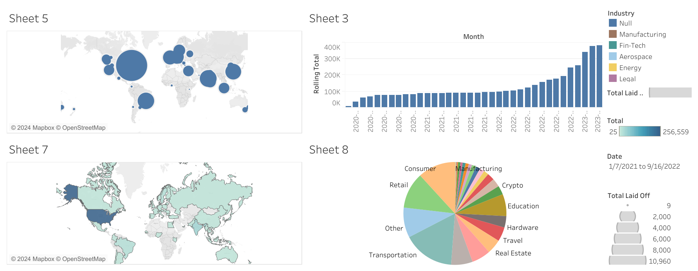

# Layoffs_SQL

## Overview

This project involves cleaning and analyzing a dataset containing information about tech layoffs from the onset of the COVID-19 pandemic to the present. The dataset is sourced from [Layoffs.fyi](https://www.kaggle.com/datasets/swaptr/layoffs-2022) and covers various tech firms around the globe. The analysis aims to uncover trends and insights about these layoffs using SQL for data cleaning and analysis, and Tableau for visualization.

## Dataset Description

### Source

- [Kaggle: Layoffs Dataset](https://www.kaggle.com/datasets/swaptr/layoffs-2022)

### Context

Tech firms around the globe are experiencing economic slowdowns, leading to significant layoffs. This dataset tracks layoffs reported on platforms such as Bloomberg, San Francisco Business Times, TechCrunch, and The New York Times, starting from March 11, 2020, to June 1, 2024.

### Content

- `company`: Name of the company
- `location`: Location of company headquarters
- `industry`: Industry of the company
- `total_laid_off`: Number of employees laid off
- `percentage_laid_off`: Percentage of employees laid off
- `date`: Date of layoff
- `stage`: Stage of funding
- `country`: Country
- `funds_raised`: Funds raised by the company (in millions of dollars)

## Project Structure

### Repository Contents

- `Layoff_Data_Cleaning.sql`: SQL script for data cleaning
- `Layoff_Data_Analysis.sql`: SQL script for data analysis
- `README.md`: Project documentation
- Tableau Visualizations:
  - [Sheet 8: Layoff by Industry](https://public.tableau.com/views/layoff_industry_wise/Sheet8?:language=en-US&:sid=&:display_count=n&:origin=viz_share_link)
  - [Sheet 7: Layoff by Country](https://public.tableau.com/views/layoff_country_wise/Sheet7?:language=en-US&:sid=&:display_count=n&:origin=viz_share_link)
  - [Sheet 3: Rolling Monthly Total Layoffs](https://public.tableau.com/views/layoff_rolling_monthly_total/Sheet3?:language=en-US&:sid=&:display_count=n&:origin=viz_share_link)
  - [Sheet 5: Layoff by City](https://public.tableau.com/views/layoff_city_wise/Sheet5?:language=en-US&:sid=&:display_count=n&:origin=viz_share_link)

## Data Cleaning

The data cleaning process is detailed in the `Layoff_Data_Cleaning.sql` script. Key steps include:

1. **Creating a Staging Table**: 
   - A staging table is created to work on and clean the data while preserving the raw data.

2. **Removing Duplicates**:
   - Duplicate entries are identified and removed to ensure data integrity.

3. **Standardizing Data**:
   - Standardization of industry names, dates, and country names to maintain consistency.
   - Null values are addressed where possible, filling in missing industry names based on available data.

4. **Handling Null Values**:
   - An analysis of null values is performed, and non-useful data is removed.

5. **Final Clean-Up**:
   - Unnecessary columns and rows are deleted.

## Data Analysis

The data analysis process is captured in the `Layoff_Data_Analysis.sql` script. Key analyses include:

1. **Exploratory Data Analysis (EDA)**:
   - Basic statistics and trends are explored to understand the dataset better.

2. **Advanced Queries**:
   - Detailed queries are performed to find specific insights such as companies with the highest layoffs, layoffs by industry, country, and city.

3. **Time-Series Analysis**:
   - Rolling totals of layoffs per month are calculated to visualize trends over time.
  
**Python Decision Tree for Layoffs Prediction**

   - Implemented a decision tree model using the Gini index to predict the percentage of employees laid off based on company data.
   - Trained the model on cleaned data and provided predictions for new input data.

   [Python Decision Tree Code](gini_predictor.py)
**Predictive Modeling**
  - Built a decision tree model to predict the percentage of employees laid off based on company attributes.
  - Achieved accurate predictions using the Gini index to measure node impurity and optimize splits.

## Tableau Visualizations

The cleaned and analyzed data is visualized using Tableau. The following sheets and dashboard provide a comprehensive view of the layoff trends:

1. **[Sheet 8: Layoff by Industry](https://public.tableau.com/views/layoff_industry_wise/Sheet8?:language=en-US&:sid=&:display_count=n&:origin=viz_share_link)**:
   - Visualization of layoffs categorized by industry.
   - Total layoffs across various industries are displayed.

2. **[Sheet 7: Layoff by Country](https://public.tableau.com/views/layoff_country_wise/Sheet7?:language=en-US&:sid=&:display_count=n&:origin=viz_share_link)**:
   - Visualization of layoffs categorized by country.
   - Total layoffs across different countries are displayed.

3. **[Sheet 3: Rolling Monthly Total Layoffs](https://public.tableau.com/views/layoff_rolling_monthly_total/Sheet3?:language=en-US&:sid=&:display_count=n&:origin=viz_share_link)**:
   - Rolling monthly total of layoffs to visualize trends over time.

4. **[Sheet 5: Layoff by City](https://public.tableau.com/views/layoff_city_wise/Sheet5?:language=en-US&:sid=&:display_count=n&:origin=viz_share_link)**:
   - Visualization of layoffs categorized by city.
   - Total layoffs in different cities are displayed.

## Dashboard

[](https://public.tableau.com/shared/R4H4QCZQS?:display_count=n&:origin=viz_share_link)


## Usage

### Requirements

- Python 3.x
- SQL Database (MySQL, PostgreSQL, etc.)
- Tableau Desktop or Tableau Public

### Installation

1. Clone the repository:

   ```bash
   git clone https://github.com/1midhush/Layoffs_SQL.git
   cd Layoffs_SQL

## Conclusion

This project showcases the power of SQL in data cleaning and analysis, complemented by Tableau's visualization capabilities. The insights derived from this project can help understand the impact of economic slowdowns on the tech industry and identify trends and patterns in layoffs.

For any questions or contributions, please feel free to open an issue or submit a pull request.
